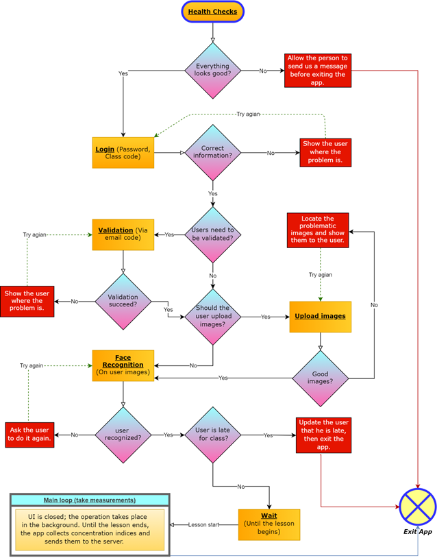
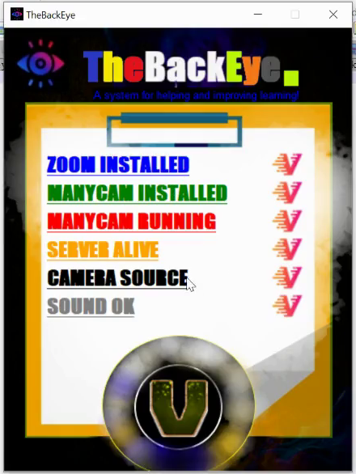
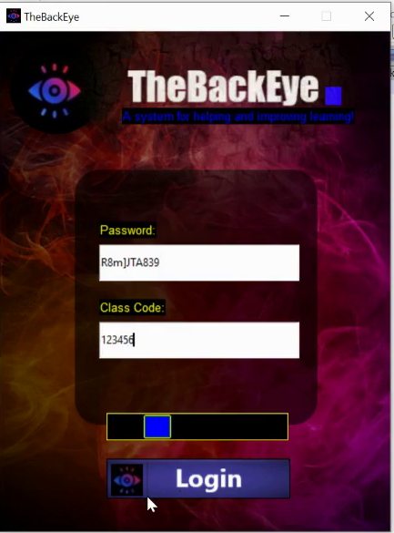
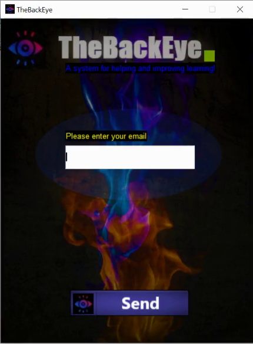
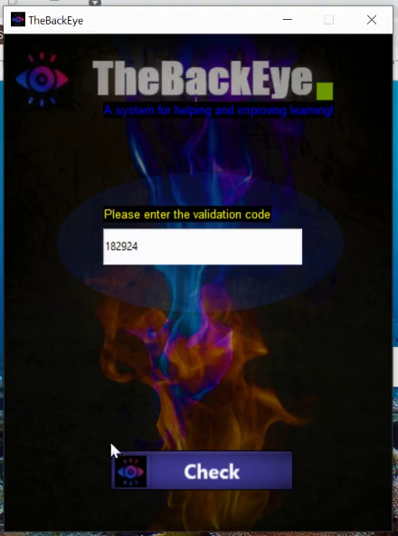
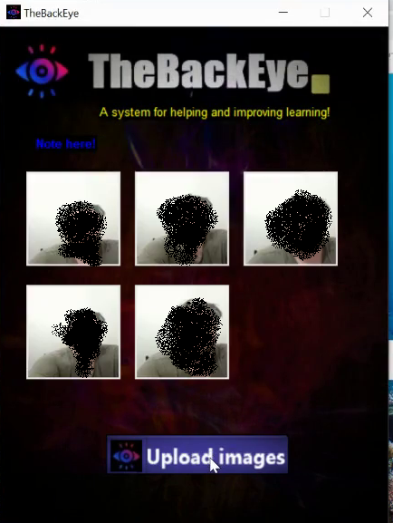
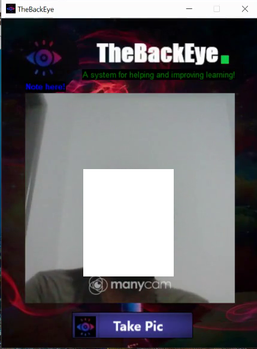
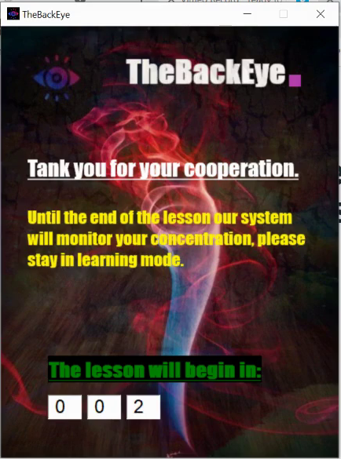
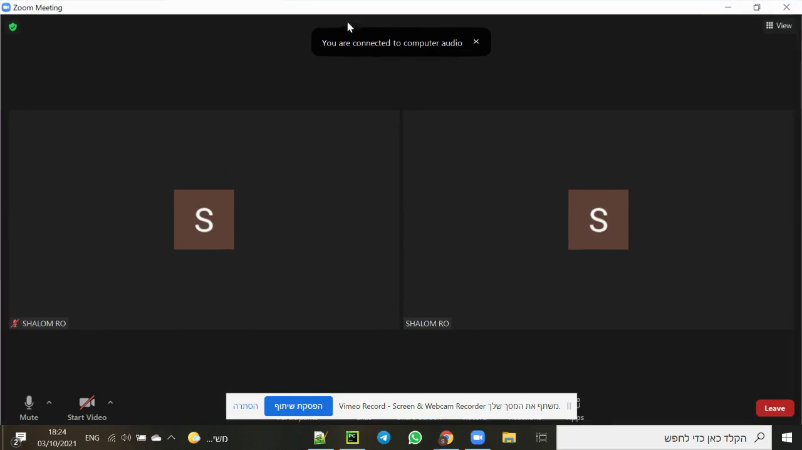

# TheBachEye

**Project background** - as a result of the Coronavirus epidemic, we became accustomed to online courses. The goal of this project was to make it easier for teachers to supervise and monitor these lessons. Our customers are teachers who teach online, and we provide metrics showing whether students are paying attention or taking part in other activities. Due to a monitoring app running on their computers, students also become customers as they are encouraged to focus on class assignments based on class policies. The innovative aspect of our project is the unprecedented data the teacher has when using it. The monitoring  app uses camera frames simultaneously with the online lesson platform (e.g., Zoom, Skype, etc.) to determine the level of student concentration based on several metrics.  Our system allows teachers to enforce policies about specific lessons (for instance, enforce the OnTop policy, under which students are forced to watch only the online lesson). A metrics graph will be displayed to the teacher showing the class or individual student concentration percentages, even in real time. Additionally, an attendance report will be available to the teacher by the end of each lesson.
One other innovative feature of the program is the ability to help the students focus on the lesson, without being distracted by other things. 

**The app includes and supports the following list of features**

●	Taking a list of the following measures:
1.	On top - check if the desired program is on top or not and react accordingly.
2.	Sleep detection - check if the student is taking a nap or not.
3.	Head pose - determine if the head is facing toward the screen or not.
4.	Face recognition - authenticate that the student is indeed the real student not someone else.
5.	Face detector  - ensure that there is a face in front of the camera.
6.	Object Detector - detects objects that interfere with learning - cellphone for example.
7.	Sound Check - check if the student's sound is on and loud.

●	Active Mode - When the teacher turns on the active mode, the student app forces the follow:
○	The lesson platform must be on top and onto a full screen.
○	The student’s computer sound level is forced to be on and loud.
○	In addition, alert system alerts the student when it detects a lack of concentration.

●	Health Checks -  Tests that run when the student app is loading. They check whether the prerequisites for the app are fulfilled - manycam and the lesson platform are installed and accessing the camera frames is enabled.

●	Alert System - Whenever the student is not focused for a predetermined period of time, the system alerts him and gets his attention.

**User flows of students in the desktop app**

1)	Student passes the health checks -> logs in -> face recognized -> lesson starts -> lesson ends -> app closed.
2)	Student fails the Health Checks -> student sends a message to TheBackEye team -> app closed.
3)	Student passes Health Checks -> login -> validate email -> upload images -> face recognition -> wait for lesson to start -> lesson starts -> lesson ends -> app closed.
4)	Student passes the Health Checks -> login ->  face recognized -> late for the lesson -> app closed.
5)	Student passes the Health Checks -> login -> upload bad images -> need to upload again -> upload good images -> face recognized -> lesson starts -> lessons ends -> app closed. 

**Diagram of student desktop app**

A UI page is represented by an orange rectangle.
A rhombus represents a control action taken on the UI controller.
Red boxes indicate what happens when UI controllers respond to a bad action (e.g., failure to log in by the student).

**Desktop App Architecture**

Written in Python3.7. Uses ManyCam Service to gain access to camera frames simultaneously with lesson platform application (such as: Zoom, Skype etc..).
Image Processing and OpenCV - AI libraries are utilized to analyze frames, as well as other metrics (OnTop, SoundCheck) to determine the student's concentration during the live lesson. HTTP requests are then used to transmit the results to a remote web API server, hosted in Azure cloud, which connects to a SQL server database (hosted in Azure cloud as well).

**Snapshots**

